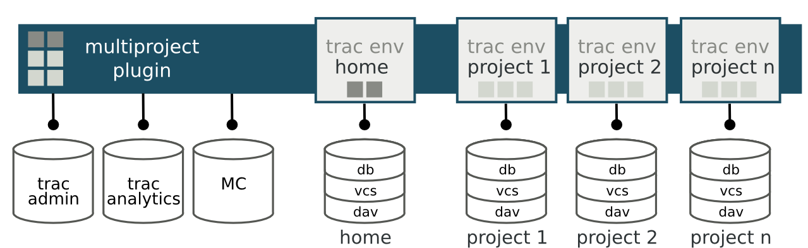

.. _install:

============
Installation
============
This chapter gives instructions how to setup a new MultiProject powered Trac environment.
For updating an existing setup, see section: :ref:`Updating existing setup <usage-update>`

Setup consists from LAMP_ setup, where Apache is used for web server, running the Python_ based
applications. MySQL_ is used for datastorage and Memcache_ for caching (optional, but recommended).
Each project is a separate Trac_ environment, with few adjustments:

- Each project has an unique identifier
- Each project has own database, named after identifier
- Each project has own version control repository, named after identifier
- Project environments inherits the shared ``project.ini`` configuration making it easy to manage

In addition, there are:

- Special Trac environment `home`, that has a custom set of components enabled for:
  creating projects, user management, statistics.
- Centralized management database ``trac_admin`` that contains information about projects, users and permissions.
- Data analytics database ``trac_analytical`` for collecting and managing statistics information (optional)

   Overview of the setup

.. toctree::
   :maxdepth: 2

   server
   plugins
   theme
   extra

